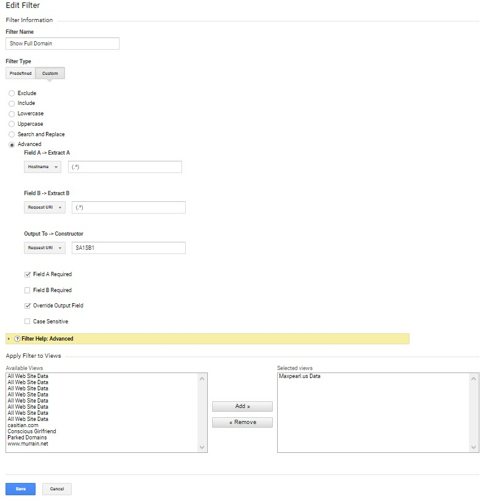

# Analytics for Bypass Censorship Mirrors and Onions

## Analytics for Onions

If you are using Google Analytics, you can add a filter which will show all domain names:

And once you add that filter, your analytics reports will show the domains, with regular and onion domains:

