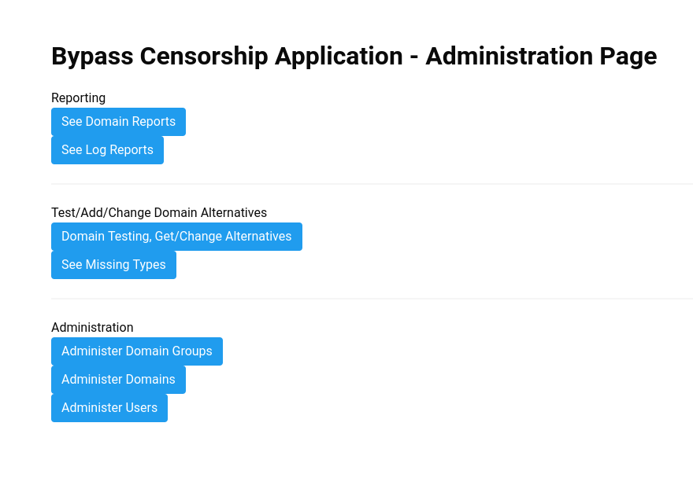
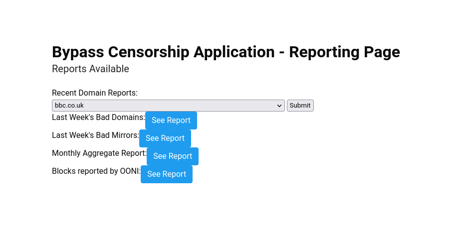
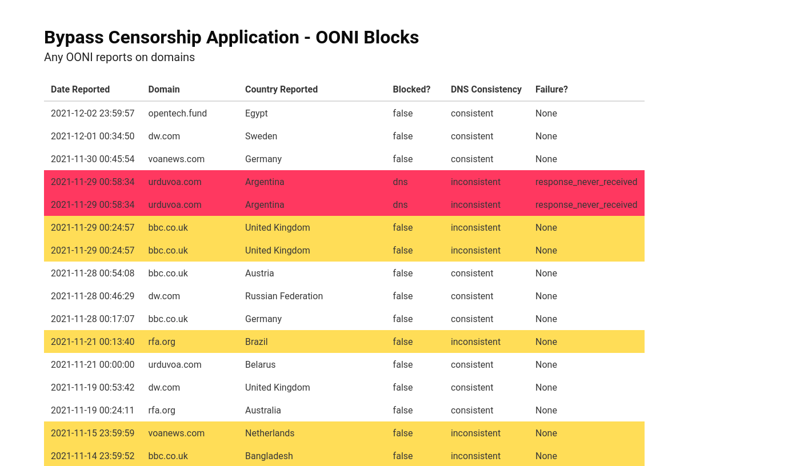
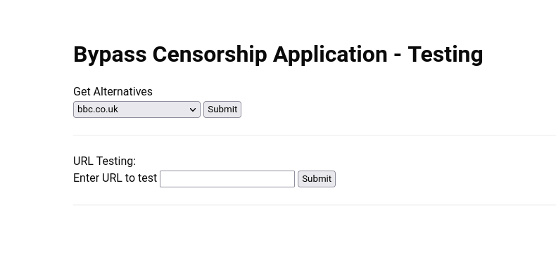
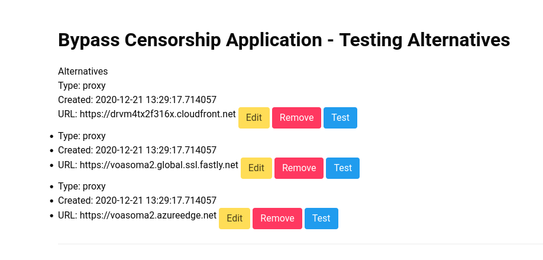
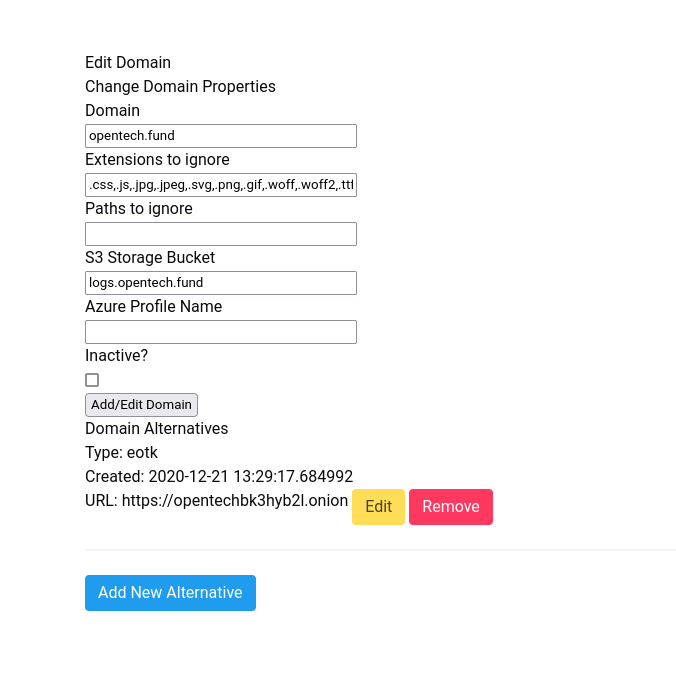

# Administrator Documentation

The administrator interface:

## Reporting

This is reporting on domain and mirror testing - are domains and mirrors up and working?

The reporting screen has several options:

1. Recent Domain Reports: Choose one domain from the list, and you'll see a report that lists about 25 of the last reports on that domain, including status codes for domain and all alternatives.
2. Last Week's bad domains: A list of all domains with status codes not equal to 200 in the last 7 days.
3. Last week's bad mirrors: a list of all mirrors with status codes not equal to 200 in the last 7 days.
4. Monthly aggregate report: It takes a while to generate - it's all of the reports over the month with a status code not equal to 200, and what percent of the month that domain or mirror has had that code.
5. Blocks reported by OONI: These are domain reports from OONI for all domains in the repository. Yellow indicates possible blockage, red indicates likely state-level blockage.  

### Log Reporting

This is reporting on domains that have been set up for logging. Choose a domain, and then you can see recent reports on where the logs come from, and visitors, etc.

## Testing domains

You can choose to get a list of alternatives per domain, and also can test any URL (no matter whether or not the domain is in the repostory/database)

You can see all alternatives for a domain. From this screen, you can edit an alternative, test it, or remove it. 

## See missing types

You can see what kinds of mirrors are missing for a domain, or see what kinds of domain proxies are missing from a particular service.

## Administer Domain Groups

Domain groups allow you to give users access to their particular domains for testing and reporting. When you administer users, you can add them to a domain group. Those users will *only* have access to the domains in their group.

## Administer Domains

The main domain administration screen lists all domains. You can delete domains, assign to domain groups, or edit domains.

The edit domain screen includes options to add extensios and paths for log analysis to ignore, and adding storage buckets and Azure profile names for log storage. You can inactivate a domain here (which will delete the domain from the repository, and mark it inactive in the database.)

You can also add and edit alternatives from this screen.

## Administer Users

Add/edit and delete users. Assign as admins, or assign to domain groups.