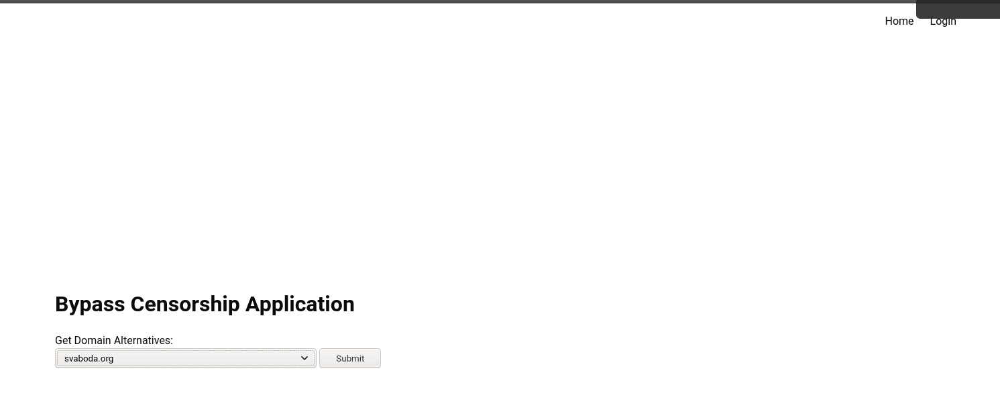
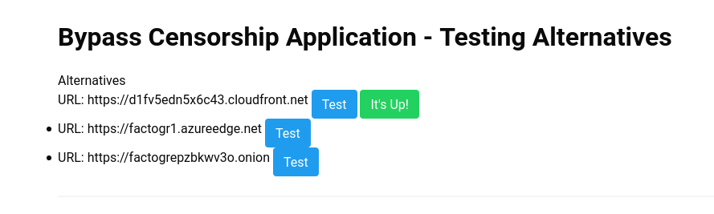
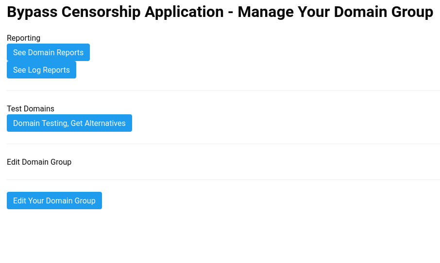
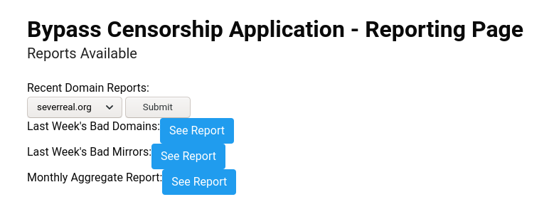
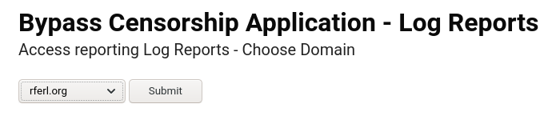

# Public Features

## Get alternatives

Without logging in, you can retrieve and test alternatives to domain names in the Bypass Censorship mirror repository.

# Domain Managers

When you log into the application, you'll see the following menu at the top:

You have several options:

## Domain Reports

These are reports generated on a daily basis, testing each domain and alternative, and reporting on status. 

You can choose to generate a report on one specific domain, or look at aggregates - all bad domains for the week, all bad mirrors, or a monthly aggregate report of bad domains and mirrors.

## Log Reports

Log reports are reports on visits to the alternatives. 

You choose one domain, and retrieve the log reports on each domain.

## Edit Domain Group

Domains are grouped - if you have been given the permissions to manage a domain group, you can also change the name and add any notes to your domain group.

# Administrators

See [administrator documentation](administrator.md)